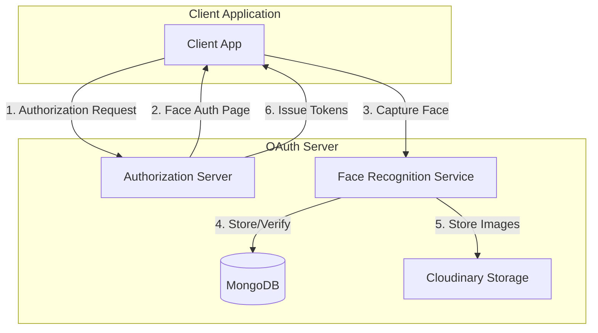
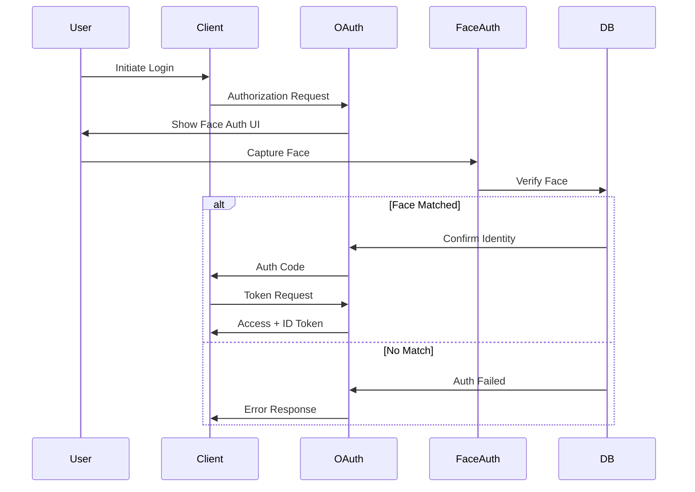
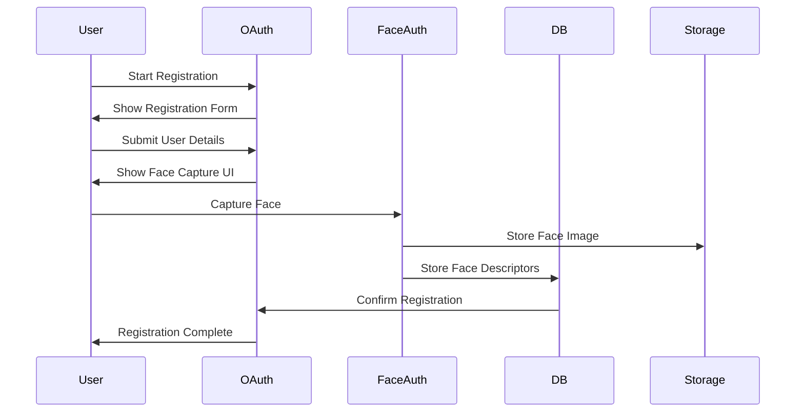
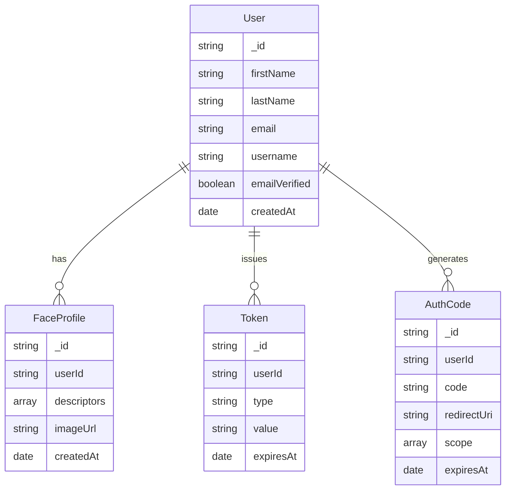

# Face Authentication OAuth Server

A complete OAuth 2.0 server implementation with facial recognition authentication, built with Node.js, Express, and MongoDB.

## Overview

This project implements a custom OAuth 2.0 Authorization Server with facial recognition as the primary authentication method. It allows applications to authenticate users through their face, providing a passwordless and secure authentication experience.

## System Architecture



## Authentication Flow



## Registration Flow



## Features

- **OAuth 2.0 Authorization Code Flow**: Standard OAuth implementation with support for OpenID Connect
- **Face Authentication**: Biometric authentication using face recognition
- **User Registration**: Complete user registration flow with face enrollment
- **MongoDB Integration**: Persistent storage for user profiles and face data
- **Cloudinary Integration**: Cloud storage for profile images
- **JWT Tokens**: Secure token generation and validation
- **OIDC Compliant**: Follows OpenID Connect standards for identity verification

## Tech Stack

### Backend
- **Node.js**: JavaScript runtime environment
- **Express**: Web application framework
- **MongoDB**: NoSQL database for storing user data and face profiles
- **Mongoose**: MongoDB object modeling for Node.js
- **face-api.js**: JavaScript API for face detection and recognition
- **JWT**: JSON Web Tokens for secure authentication
- **Multer**: Middleware for handling file uploads
- **Cloudinary**: Cloud service for image storage and management

### Frontend
- **React**: JavaScript library for building user interfaces
- **React Router**: Navigation for React applications
- **face-api.js (client-side)**: Face detection in the browser
- **HTML5 Canvas**: For capturing and processing face images

## Data Models



## Security Features

1. **Face Recognition Security**
   - Multiple face descriptors stored for better matching
   - Adjustable confidence threshold
   - Liveness detection support
   
2. **OAuth Security**
   - PKCE support for mobile apps
   - Short-lived authorization codes
   - Secure token storage
   - HTTPS enforcement in production

3. **Data Security**
   - Encrypted face descriptors
   - Secure image storage in Cloudinary
   - JWT token encryption
   - Session management

## Setup Instructions

### Prerequisites

- Node.js (v14 or higher)
- MongoDB (local instance or MongoDB Atlas)
- Cloudinary account for image storage

### Installation

1. Clone the repository
   ```bash
   git clone <repository-url>
   cd react-face-detection-main
   ```

2. Install dependencies
   ```bash
   npm install
   ```

3. Configure environment variables
   Create a `.env` file in the root directory with:
   ```env
   # Server Configuration
   PORT=5001
   NODE_ENV=development

   # MongoDB Configuration
   MONGODB_URI=mongodb://localhost:27017/face-auth

   # Session and OAuth Configuration
   SESSION_SECRET=your_session_secret
   OAUTH_CLIENT_ID=face-auth-client
   OAUTH_CLIENT_SECRET=your_client_secret

   # Cloudinary Configuration
   NEXT_PUBLIC_CLOUDINARY_CLOUD_NAME=your_cloud_name
   CLOUDINARY_API_KEY=your_api_key
   CLOUDINARY_API_SECRET=your_api_secret
   ```

4. Start the OAuth server
   ```bash
   node oauth-server.js
   ```

5. Start the React frontend
   ```bash
   npm start
   ```

## Integration Guide

### OAuth Client Integration

1. Register your client application
2. Configure OAuth endpoints:
   - Authorization: `/oauth/authorize`
   - Token: `/oauth/token`
   - UserInfo: `/oauth/userinfo`

3. Implement authorization flow:
   ```javascript
   // Redirect to authorization
   window.location.href = 'http://localhost:5001/oauth/authorize?' + 
     'client_id=face-auth-client&' +
     'redirect_uri=http://localhost:3000/callback&' +
     'response_type=code&' +
     'scope=openid profile&' +
     'state=random_state';

   // Exchange code for tokens
   const response = await fetch('http://localhost:5001/oauth/token', {
     method: 'POST',
     headers: { 'Content-Type': 'application/json' },
     body: JSON.stringify({
       grant_type: 'authorization_code',
       code: 'received_code',
       redirect_uri: 'http://localhost:3000/callback',
       client_id: 'face-auth-client',
       client_secret: 'your_client_secret'
     })
   });
   ```

## License

MIT
